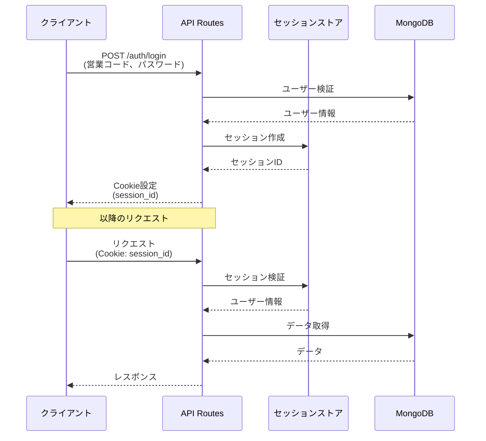

# システムアーキテクチャ

本システムのアーキテクチャと設計方針について記載します。

## システム構成

### フルスタック Next.js 構成

```
┌─────────────────────────────────────────────┐
│         クライアント（ブラウザ）              │
│  ┌─────────────────────────────────────┐   │
│  │  Next.js App Router (React)         │   │
│  │  - Server Components                │   │
│  │  - Client Components                │   │
│  │  - shadcn/ui + Tailwind CSS         │   │
│  └─────────────────────────────────────┘   │
└─────────────────────────────────────────────┘
                    ↓ HTTPS
┌─────────────────────────────────────────────┐
│         Next.js Server (Cloud Run)          │
│  ┌─────────────────────────────────────┐   │
│  │  API Routes (Hono)                  │   │
│  │  - REST API                         │   │
│  │  - OpenAPI + Zod バリデーション      │   │
│  │  - セッション管理                    │   │
│  └─────────────────────────────────────┘   │
└─────────────────────────────────────────────┘
                    ↓
┌─────────────────────────────────────────────┐
│         MongoDB Atlas                       │
│  - 日報データ                               │
│  - ユーザーマスタ                           │
│  - 顧客マスタ                               │
└─────────────────────────────────────────────┘
```

### レイヤー構成

```
┌─────────────────────────────────────┐
│  Presentation Layer                 │
│  - Pages (App Router)               │
│  - Components (shadcn/ui)           │
│  - Client/Server Components         │
└─────────────────────────────────────┘
              ↓
┌─────────────────────────────────────┐
│  API Layer                          │
│  - API Routes (Hono)                │
│  - OpenAPI Schema                   │
│  - Zod Validation                   │
│  - Middleware (Auth, CORS, etc.)    │
└─────────────────────────────────────┘
              ↓
┌─────────────────────────────────────┐
│  Business Logic Layer               │
│  - Services                         │
│  - Domain Models                    │
│  - Validation Rules                 │
└─────────────────────────────────────┘
              ↓
┌─────────────────────────────────────┐
│  Data Access Layer                  │
│  - Prisma Client                    │
│  - Repository Pattern               │
│  - Query Builders                   │
└─────────────────────────────────────┘
              ↓
┌─────────────────────────────────────┐
│  Database                           │
│  - MongoDB (Prisma ORM)             │
└─────────────────────────────────────┘
```

## 認証・認可フロー

### セッションベース認証



### 認可制御

| エンドポイント   | 営業担当者      | 管理者（上長） |
| ---------------- | --------------- | -------------- |
| 日報作成・編集   | ○（自分のみ）   | ○              |
| 日報閲覧         | ○（自分のみ）   | ○（全員）      |
| コメント追加     | ×               | ○              |
| コメント確認済み | ○（自分の日報） | ×              |
| 顧客マスタ       | ○（閲覧・編集） | ○              |
| 営業マスタ       | ×               | ○              |

## データモデル

### 主要エンティティ

1. **Sales（営業マスタ）**: 営業担当者情報
2. **Customer（顧客マスタ）**: 顧客情報
3. **DailyReport（日報）**: 日報の基本情報
4. **VisitRecord（訪問記録）**: 日報に紐づく訪問記録
5. **Comment（コメント）**: 日報に対するコメント

### エンティティ関係図（ER図）

詳細なER図とフィールド定義は [要件定義書](../requirements_definition.md#5-er図) を参照してください。

**主要なリレーションシップ**:

- Sales 1 : N DailyReport（営業担当者は複数の日報を持つ）
- DailyReport 1 : N VisitRecord（日報は複数の訪問記録を持つ）
- DailyReport 1 : N Comment（日報は複数のコメントを持つ）
- Customer 1 : N VisitRecord（顧客は複数の訪問記録を持つ）
- Sales 1 : N Comment（営業担当者は複数のコメントを作成する）
- Sales 1 : N Customer（営業担当者は複数の顧客を担当する）
- Sales 1 : N Sales（上長関係：自己参照）

### Prismaスキーマ

Prismaスキーマは `prisma/schema.prisma` に定義します。

**例**:

```prisma
model Sales {
  id          String   @id @default(auto()) @map("_id") @db.ObjectId
  salesCode   String   @unique
  salesName   String
  email       String   @unique
  department  String
  isManager   Boolean  @default(false)
  managerId   String?  @db.ObjectId
  manager     Sales?   @relation("ManagerSubordinate", fields: [managerId], references: [id], onDelete: NoAction, onUpdate: NoAction)
  subordinates Sales[] @relation("ManagerSubordinate")

  dailyReports DailyReport[]
  comments     Comment[]
  customers    Customer[]

  createdAt   DateTime @default(now())
  updatedAt   DateTime @updatedAt

  @@map("sales")
}

model DailyReport {
  id          String   @id @default(auto()) @map("_id") @db.ObjectId
  salesId     String   @db.ObjectId
  reportDate  DateTime
  problem     String?
  plan        String?
  status      String
  submittedAt DateTime?

  sales        Sales         @relation(fields: [salesId], references: [id], onDelete: Cascade)
  visitRecords VisitRecord[]
  comments     Comment[]

  createdAt   DateTime @default(now())
  updatedAt   DateTime @updatedAt

  @@unique([salesId, reportDate])
  @@map("daily_reports")
}

// 他のモデルも同様に定義...
```

## API設計

### REST API

全てのAPIエンドポイントは `/api/v1` 配下に配置します。

詳細なAPI仕様は [API仕様書](../api_specification.md) を参照してください。

### エンドポイント一覧（主要）

| カテゴリ | メソッド | エンドポイント               | 説明             |
| -------- | -------- | ---------------------------- | ---------------- |
| 認証     | POST     | /api/v1/auth/login           | ログイン         |
| 認証     | POST     | /api/v1/auth/logout          | ログアウト       |
| 認証     | GET      | /api/v1/auth/session         | セッション確認   |
| 日報     | GET      | /api/v1/reports              | 日報一覧取得     |
| 日報     | GET      | /api/v1/reports/:id          | 日報詳細取得     |
| 日報     | POST     | /api/v1/reports              | 日報作成         |
| 日報     | PUT      | /api/v1/reports/:id          | 日報更新         |
| 日報     | DELETE   | /api/v1/reports/:id          | 日報削除         |
| コメント | POST     | /api/v1/reports/:id/comments | コメント追加     |
| コメント | PUT      | /api/v1/comments/:id/read    | コメント確認済み |
| 顧客     | GET      | /api/v1/customers            | 顧客一覧取得     |
| 顧客     | POST     | /api/v1/customers            | 顧客作成         |
| 営業     | GET      | /api/v1/sales                | 営業一覧取得     |

### OpenAPI + Zod による型安全なAPI

```typescript
// スキーマ定義例 (Zod)
import { z } from 'zod';

export const createReportSchema = z.object({
  reportDate: z.string().date(),
  problem: z.string().max(1000).optional(),
  plan: z.string().max(1000).optional(),
  status: z.enum(['draft', 'submitted']),
  visitRecords: z
    .array(
      z.object({
        customerId: z.string(),
        visitDatetime: z.string().datetime(),
        visitContent: z.string().max(500),
        visitResult: z.string().max(500).optional(),
        displayOrder: z.number().int().positive(),
      })
    )
    .min(1)
    .max(10),
});

export type CreateReportInput = z.infer<typeof createReportSchema>;
```

### API Routes実装例（Hono）

```typescript
// app/api/v1/reports/route.ts
import { Hono } from 'hono';
import { zValidator } from '@hono/zod-validator';
import { createReportSchema } from '@/lib/schemas/report';

const app = new Hono();

app.post('/reports', zValidator('json', createReportSchema), async (c) => {
  const data = c.req.valid('json');

  // ビジネスロジック
  const report = await createReport(data);

  return c.json({ status: 'success', data: report }, 201);
});

export const POST = app.fetch;
```

## フロントエンド構成

### App Router構成

```
app/
├── (auth)/                     # 認証関連ページグループ
│   ├── login/
│   │   └── page.tsx           # ログインページ
│   └── layout.tsx             # 認証レイアウト
│
├── (dashboard)/                # ダッシュボードページグループ
│   ├── layout.tsx             # ダッシュボードレイアウト
│   ├── page.tsx               # ホーム画面
│   ├── reports/
│   │   ├── page.tsx           # 日報一覧
│   │   ├── [id]/
│   │   │   └── page.tsx       # 日報詳細
│   │   ├── new/
│   │   │   └── page.tsx       # 日報作成
│   │   └── [id]/edit/
│   │       └── page.tsx       # 日報編集
│   ├── customers/
│   │   ├── page.tsx           # 顧客一覧
│   │   └── [id]/
│   │       └── page.tsx       # 顧客詳細
│   └── sales/                 # 管理者のみ
│       └── page.tsx           # 営業マスタ
│
├── api/                        # API Routes
│   └── v1/
│       ├── auth/
│       ├── reports/
│       ├── comments/
│       ├── customers/
│       └── sales/
│
└── layout.tsx                  # ルートレイアウト
```

### Server ComponentsとClient Componentsの使い分け

**Server Components（デフォルト）**:

- ページコンポーネント（page.tsx）
- レイアウトコンポーネント（layout.tsx）
- データフェッチが必要なコンポーネント
- SEOが重要なコンポーネント

**Client Components（"use client"指定）**:

- インタラクティブなUIコンポーネント（ボタン、フォーム等）
- useState, useEffect等のフックを使用するコンポーネント
- イベントハンドラを持つコンポーネント
- ブラウザAPIを使用するコンポーネント

## セキュリティ

### 実装するセキュリティ対策

1. **認証・認可**
   - セッションベース認証
   - セッションタイムアウト（30分）
   - ログイン失敗時のレート制限

2. **データ保護**
   - HTTPS通信のみ
   - パスワードのbcryptハッシュ化
   - 環境変数による機密情報管理

3. **セキュリティヘッダー**
   - X-Content-Type-Options
   - X-Frame-Options
   - X-XSS-Protection
   - Strict-Transport-Security
   - Content-Security-Policy

4. **攻撃対策**
   - SQLインジェクション対策（Prismaのプリペアドステートメント）
   - XSS対策（Reactの自動エスケープ）
   - CSRF対策（CSRFトークン）

詳細は [API仕様書のセキュリティ仕様](../api_specification.md#セキュリティ仕様) を参照してください。

## パフォーマンス最適化

### フロントエンド

- Server Componentsによるサーバーサイドレンダリング
- 画像の最適化（Next.js Image）
- コード分割（Dynamic Import）
- Suspenseによるローディング状態の管理

### バックエンド

- Prismaのクエリ最適化
- ページネーション（20件/ページ）
- インデックスの適切な設定
- キャッシュ戦略（必要に応じて）

### データベース

- 適切なインデックス設計
- クエリのパフォーマンス監視
- MongoDB Atlasのパフォーマンス監視機能の活用

## スケーラビリティ

### 水平スケーリング

- Google Cloud Runの自動スケーリング機能
- ステートレスなAPI設計
- セッションストアの外部化（Redis等、必要に応じて）

### データベーススケーリング

- MongoDB Atlasのクラスター機能
- レプリケーションとシャーディング（必要に応じて）

## 監視・ログ

### ログ管理

- Google Cloud Loggingによる集約
- エラーログの収集と分析
- アクセスログの記録

### 監視

- Cloud Runのメトリクス監視
- MongoDB Atlasの監視機能
- アラート設定

## 参考ドキュメント

- [要件定義書](../requirements_definition.md) - データモデル詳細
- [API仕様書](../api_specification.md) - APIエンドポイント詳細
- [画面定義書](../screen_definition.md) - 画面遷移とUI仕様
