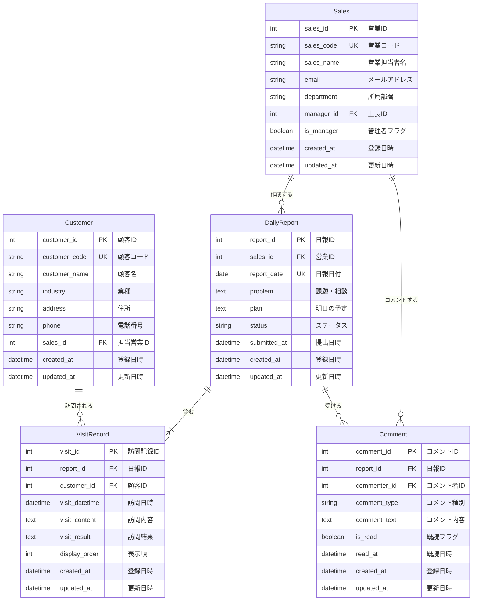

# 営業日報システム 要件定義書 (改訂版)

## 1. システム概要
営業担当者が日々の営業活動を記録し、上長が確認・コメントできる日報管理システム

## 2. 主要機能

### 2.1 日報管理機能
- **日報作成**: 営業担当者が日次で作成
- **訪問記録**: 1日に複数の顧客訪問を記録可能
  - 訪問した顧客
  - 訪問内容・結果
  - 訪問日時
- **Problem(課題・相談)**: 当日の課題や上長への相談事項を記載
- **Plan(明日の予定)**: 翌日の活動計画を記載

### 2.2 承認・コメント機能
- 上長による日報の確認
- Problem、Planに対するコメント機能
- **コメント確認機能**: 営業担当者が上長からのコメントを確認済みにする機能
  - 各コメントに「確認済みにする」ボタンを配置
  - 確認済みコメントと未確認コメントを区別して表示
  - 未確認コメント数をホーム画面に表示

### 2.3 マスタ管理機能
- **顧客マスタ**: 顧客情報の管理
- **営業マスタ**: 営業担当者情報の管理

## 3. ユーザー種別
- **営業担当者**: 日報の作成・編集、コメントの確認
- **上長**: 日報の閲覧・コメント

## 4. データ構造

### 4.1 主要エンティティ
1. **営業マスタ** (Sales)
2. **顧客マスタ** (Customer)
3. **日報** (DailyReport)
4. **訪問記録** (VisitRecord)
5. **コメント** (Comment)

## 5. ER図

以下、Mermaidで記述したER図です:

## 6. 補足説明

### 6.1 リレーションシップ
- 営業マスタは自己参照により上長関係を表現
- 1つの日報に複数の訪問記録が紐づく
- 1つの日報に複数のコメントが紐づく
- コメント種別で「Problem」「Plan」を区別

### 6.2 主要な制約
- 日報は営業ID×日付でユニーク
- 訪問記録は日報に必ず紐づく
- コメントは管理者権限を持つ営業のみ作成可能

### 6.3 ステータス管理
日報のステータス例:
- `draft`: 下書き
- `submitted`: 提出済み
- `commented`: コメント済み

### 6.4 コメント既読管理
- `is_read`: false（未読）/ true（既読）
- `read_at`: 既読にした日時（未読の場合はNULL）
- 営業担当者が「確認済みにする」ボタンを押下した時点で既読となる
- 上長（コメント作成者）自身のコメントは既読管理の対象外

---

## 7. 主要な業務フロー

### 7.1 日報作成〜コメント確認フロー
1. 営業担当者が日報を作成・提出
2. 上長が日報を確認し、Problem/Planにコメントを追加
3. 営業担当者のホーム画面に未確認コメント数が表示される
4. 営業担当者が日報詳細画面でコメントを確認
5. 営業担当者が各コメントの「確認済みにする」ボタンを押下
6. コメントが既読状態になり、未確認コメント数が減少
